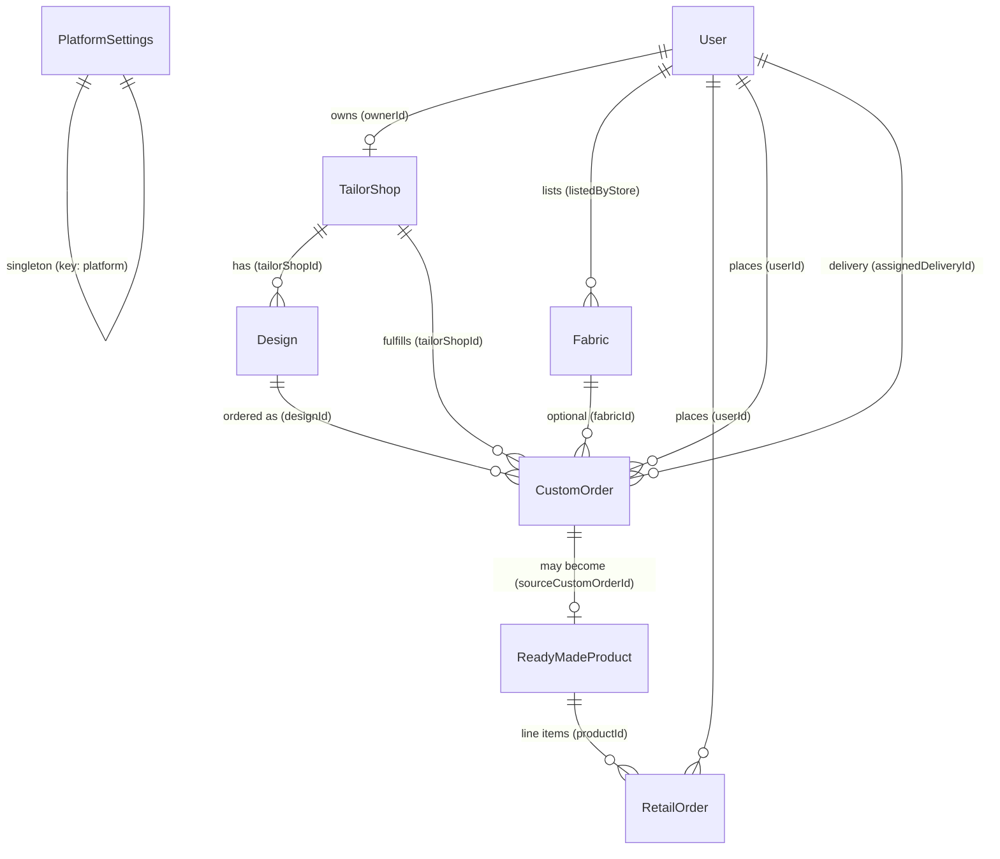

# MOTD (Mukhawar of the Day) — MongoDB Schema Handoff

Reference for backend API and frontend integration work. All models live under `backend/models/` and use Mongoose with `timestamps: true` (`createdAt`, `updatedAt` on every collection).

**Currency:** AED (5% VAT default via `PlatformSettings.vatRate`).

---

## Entity relationships

---

## Tailor approval and public visibility

Tailors self-register with `role: 'tailor'`. Admin approves or rejects accounts before they appear in customer-facing catalogs.

| Stage | `User.approvalStatus` | Tailor can do | Public catalog |
|---|---|---|---|
| Just registered | `pending` (default for tailors) | Log in; see pending-approval UI | Shop and designs **hidden** |
| Admin approves | `approved` | Create/edit one shop; CRUD own designs | Shop + designs visible when `isActive: true` |
| Admin rejects | `rejected` | Log in; blocked from publishing | **Hidden** |

**Schema enforcement (User model):**

- Default `approvalStatus`: `pending` when `role === 'tailor'`, otherwise `approved`.
- Pre-save hook forces `approvalStatus = 'approved'` for all non-tailor roles (`customer`, `admin`, `fabric_store`, `delivery`).
- Index `{ role: 1, approvalStatus: 1 }` supports admin pending-tailor queries.

**API / query rules (not enforced in schema — implement in routes):**

- Customer-facing tailor shop and design listings must filter:
  - `TailorShop.isActive === true`
  - Owner `User.role === 'tailor'` and `User.approvalStatus === 'approved'`
- Pending or rejected tailors may have a `TailorShop` document in DB (e.g. draft), but it must **not** be returned by public endpoints.
- Seed convention: approved tailors have shops + designs; pending tailor has **no** shop document.

**Roles:** `customer` | `admin` | `fabric_store` | `tailor` | `delivery` — there is no `seller` role; ready-made inventory is admin-managed only.

---

## User

**Collection:** `users`  
**File:** `backend/models/User.js`

| Field | Type | Required | Default | Notes |
|---|---|---|---|---|
| `name` | String | yes | — | Display name |
| `email` | String | yes | — | Unique |
| `password` | String | yes | — | Hashed at application layer |
| `role` | String (enum) | yes | `customer` | See **ROLES** below |
| `approvalStatus` | String (enum) | yes | role-based | See **APPROVAL_STATUSES** and approval rules above |
| `rejectionNote` | String | no | `''` | Optional admin note when `approvalStatus === 'rejected'`; cleared on approve |
| `isActive` | Boolean | yes | `true` | Account enabled; `false` blocks sign-in (used for fabric store partners) |
| `isAdmin` | Boolean | yes | `false` | Derived: `true` when `role === 'admin'` (pre-save) |

**Indexes:** `{ role: 1, approvalStatus: 1 }`, unique on `email`.

### Admin fabric store partners (C-20)

| Method | Path | Purpose |
|---|---|---|
| `GET` | `/api/admin/partners/fabric-stores` | Active partners (fabric form picker). `?includeInactive=1` includes deactivated accounts for admin list |
| `POST` | `/api/admin/create-partners` | Create `fabric_store` user (password hashed server-side) |
| `PUT` | `/api/admin/edit-partners/:id` | Update name, email, optional password reset |
| `DELETE` | `/api/admin/delete-partner/:id` | Hard delete partner |
| `PATCH` | `/api/admin/partners/fabric-stores/:id/toggle-active` | Toggle `isActive` (deactivate / reactivate) |

`fabric_store` accounts are auto-approved via User pre-save; use `isActive` for moderation instead of `approvalStatus`.

---

## PlatformSettings

**Collection:** `platformsettings`  
**File:** `backend/models/PlatformSettings.js`  
**Pattern:** Singleton — at most one document with `key: 'platform'`.

| Field | Type | Required | Default | Notes |
|---|---|---|---|---|
| `key` | String | yes | `'platform'` | Unique, immutable |
| `defaultDeliveryFee` | Number | yes | `0` | Min 0 |
| `defaultTailoringFee` | Number | yes | `0` | Min 0 |
| `platformFee` | Number | yes | `0` | Min 0 |
| `vatRate` | Number | yes | `0.05` | Min 0, max 1 (5% VAT) |
| `currency` | String (enum) | yes | `'AED'` | Only `'AED'` allowed |

**Static helper:** `PlatformSettings.getSettings()` — returns existing singleton or creates one with defaults.

**Validation:** Creating a second document with `key: 'platform'` fails with *"PlatformSettings document already exists"*.

---

## ReadyMadeProduct

**Collection:** `readymadeproducts`  
**File:** `backend/models/ReadyMadeProduct.js`  
**Scope:** Admin-managed returns/resale inventory. **No** seller or `listedBy` reference.

| Field | Type | Required | Default | Notes |
|---|---|---|---|---|
| `name` | String | yes | — | English |
| `nameAr` | String | yes | — | Arabic |
| `slug` | String | yes | — | Unique, lowercase |
| `description` | String | no | `''` | English |
| `descriptionAr` | String | no | `''` | Arabic |
| `images` | [String] | yes | `[]` | Min length 1 |
| `price` | Number | yes | — | Min 0 |
| `size` | String | yes | — | e.g. `"52"`, `"M"` |
| `style` | String (enum) | yes | — | See **READY_MADE_STYLES** |
| `city` | String | no | `''` | |
| `tag` | String | no | `''` | UI badge label |
| `tagColor` | String | no | `''` | UI badge color token |
| `returnReason` | String (enum) | yes | `'size_issue'` | See **RETURN_REASONS** |
| `sourceCustomOrderId` | ObjectId → CustomOrder | no | `null` | Optional link to originating custom order |
| `condition` | String (enum) | yes | `'excellent'` | See **CONDITIONS** |
| `countInStock` | Number | yes | `1` | Min 0 |
| `isActive` | Boolean | yes | `true` | Soft-hide from catalog |

**Indexes:** `{ isActive: 1, style: 1 }`, `{ size: 1 }`, unique sparse `{ sourceCustomOrderId: 1 }`.

---

## Fabric

**Collection:** `fabrics`  
**File:** `backend/models/Fabric.js`

| Field | Type | Required | Default | Notes |
|---|---|---|---|---|
| `name` | String | yes | — | English |
| `nameAr` | String | yes | — | Arabic |
| `slug` | String | yes | — | Unique, lowercase |
| `description` | String | no | `''` | |
| `descriptionAr` | String | no | `''` | |
| `images` | [String] | yes | `[]` | Min length 1 |
| `material` | String (enum) | yes | — | See **FABRIC_MATERIALS** |
| `color` | String | no | `''` | |
| `city` | String | no | `''` | |
| `tag` | String | no | `''` | |
| `tagColor` | String | no | `''` | |
| `pricePerMeter` | Number | yes | — | Min 0 |
| `listedByStore` | ObjectId → User | yes | — | Must be `role: 'fabric_store'` |
| `storePickupAddress` | Object | yes | — | See sub-schema below |
| `isActive` | Boolean | yes | `true` | |

### `storePickupAddress` (embedded)

| Field | Type | Required | Default |
|---|---|---|---|
| `emirate` | String | yes | — |
| `city` | String | yes | — |
| `street` | String | no | `''` |
| `building` | String | no | `''` |
| `phone` | String | no | `''` |

**Indexes:** `{ isActive: 1, material: 1 }`, `{ listedByStore: 1 }`.

---

## TailorShop

**Collection:** `tailorshops`  
**File:** `backend/models/TailorShop.js`  
**Cardinality:** One shop per tailor (`ownerId` unique).

| Field | Type | Required | Default | Notes |
|---|---|---|---|---|
| `name` | String | yes | — | English |
| `nameAr` | String | yes | — | Arabic |
| `slug` | String | yes | — | Unique, lowercase |
| `description` | String | no | `''` | |
| `descriptionAr` | String | no | `''` | |
| `logo` | String | no | `''` | URL |
| `coverImage` | String | no | `''` | URL |
| `location` | String | no | `''` | Free-text area/neighborhood |
| `city` | String | no | `''` | |
| `phone` | String | no | `''` | |
| `rating` | Number | no | `0` | Min 0, max 5 |
| `reviewCount` | Number | no | `0` | Min 0 |
| `ownerId` | ObjectId → User | yes | — | Unique; tailor owner |
| `isActive` | Boolean | yes | `true` | Public visibility also requires owner approval (see above) |

**Indexes:** `{ isActive: 1, city: 1 }`, `{ ownerId: 1 }`.

---

## Design

**Collection:** `designs`  
**File:** `backend/models/Design.js`

| Field | Type | Required | Default | Notes |
|---|---|---|---|---|
| `tailorShopId` | ObjectId → TailorShop | yes | — | Parent shop |
| `name` | String | yes | — | English |
| `nameAr` | String | yes | — | Arabic |
| `slug` | String | yes | — | Lowercase; unique per shop |
| `description` | String | no | `''` | |
| `descriptionAr` | String | no | `''` | |
| `images` | [String] | yes | `[]` | Min length 1 |
| `category` | String (enum) | yes | — | See **DESIGN_CATEGORIES** |
| `basePrice` | Number | yes | — | Min 0 |
| `tailoringFee` | Number | yes | — | Min 0 |
| `estimatedMeters` | Number | yes | — | Min 0; fabric meters for pricing |
| `estimatedDays` | Number | no | `7` | Min 1; lead time hint |
| `isActive` | Boolean | yes | `true` | |

**Indexes:** `{ tailorShopId: 1 }`, unique `{ tailorShopId: 1, slug: 1 }`, `{ tailorShopId: 1, isActive: 1 }`.

---

## RetailOrder

**Collection:** `retailorders`  
**File:** `backend/models/RetailOrder.js`  
**Journey:** Ready-made checkout (COD only in MVP).

| Field | Type | Required | Default | Notes |
|---|---|---|---|---|
| `orderType` | String (enum) | yes | `'retail'` | Immutable; always `'retail'` |
| `userId` | ObjectId → User | yes | — | Customer |
| `orderItems` | [Object] | yes | — | Min length 1; see sub-schema |
| `shippingAddress` | Object | yes | — | See sub-schema |
| `paymentMethod` | String (enum) | yes | `'cod'` | See **PAYMENT_METHODS** |
| `itemsPrice` | Number | yes | — | Min 0 |
| `shippingPrice` | Number | yes | `0` | Min 0 |
| `vatRate` | Number | yes | `0.05` | Min 0, max 1 |
| `vatAmount` | Number | yes | — | Min 0 |
| `totalPrice` | Number | yes | — | Min 0 |
| `currency` | String | yes | `'AED'` | |
| `status` | String (enum) | yes | `'pending'` | See **RETAIL_ORDER_STATUSES** |
| `isPaid` | Boolean | yes | `false` | |
| `isDelivered` | Boolean | yes | `false` | |
| `paidAt` | Date | no | `null` | |
| `deliveredAt` | Date | no | `null` | |

### `orderItems[]` (embedded)

| Field | Type | Required | Notes |
|---|---|---|---|
| `productId` | ObjectId → ReadyMadeProduct | yes | |
| `name` | String | yes | Snapshot at order time |
| `nameAr` | String | no | |
| `slug` | String | yes | |
| `image` | String | no | First image snapshot |
| `size` | String | yes | |
| `price` | Number | yes | Unit price, min 0 |
| `quantity` | Number | yes | Min 1 |

### `shippingAddress` (embedded)

| Field | Type | Required | Default |
|---|---|---|---|
| `fullName` | String | yes | — |
| `phone` | String | yes | — |
| `emirate` | String | yes | — |
| `city` | String | yes | — |
| `street` | String | no | `''` |
| `building` | String | no | `''` |
| `notes` | String | no | `''` |

**Indexes:** `{ userId: 1, createdAt: -1 }`, `{ status: 1, createdAt: -1 }`.

---

## CustomOrder

**Collection:** `customorders`  
**File:** `backend/models/CustomOrder.js`  
**Journey:** Fabric + tailor shop + design + measurements; 8-step status pipeline.

| Field | Type | Required | Default | Notes |
|---|---|---|---|---|
| `orderType` | String (enum) | yes | `'custom'` | Immutable; always `'custom'` |
| `userId` | ObjectId → User | yes | — | Customer |
| `fabricSource` | String (enum) | yes | — | `'storefront'` \| `'self'` |
| `fabricId` | ObjectId → Fabric | conditional | `null` | Required when `fabricSource === 'storefront'` |
| `fabricStoreId` | ObjectId → User | conditional | `null` | Required when `fabricSource === 'storefront'` |
| `fabricSnapshot` | Object | conditional | `null` | Required when `fabricSource === 'storefront'` |
| `fabricMeters` | Number | yes | — | Min 0 |
| `tailorShopId` | ObjectId → TailorShop | yes | — | |
| `designId` | ObjectId → Design | yes | — | |
| `designSnapshot` | Object | yes | — | Frozen at order time |
| `measurements` | Object | no | `{}` | See sub-schema |
| `customerDeliveryAddress` | Object | yes | — | Final delivery |
| `pickupAddress` | Object | yes | — | Fabric pickup / logistics |
| `status` | String (enum) | yes | `'pending'` | See **CUSTOM_STATUSES** |
| `statusHistory` | [Object] | no | `[]` | Audit trail |
| `pricing` | Object | yes | — | Full price breakdown |
| `paymentMethod` | String (enum) | yes | `'cod'` | |
| `isPaid` | Boolean | yes | `false` | |
| `paidAt` | Date | no | `null` | |
| `assignedDeliveryId` | ObjectId → User | no | `null` | `role: 'delivery'` |
| `estimatedReadyDate` | Date | no | `null` | |

### Fabric source validation (pre-validate hook)

| `fabricSource` | `fabricId` | `fabricStoreId` | `fabricSnapshot` |
|---|---|---|---|
| `'storefront'` | required | required | required |
| `'self'` | cleared to `null` | cleared to `null` | cleared to `null` |

Customer supplies their own fabric when `fabricSource === 'self'`; storefront fields are nulled automatically.

### `fabricSnapshot` (embedded)

| Field | Type | Required | Default |
|---|---|---|---|
| `name` | String | yes | — |
| `nameAr` | String | no | `''` |
| `slug` | String | no | `''` |
| `material` | String | no | `''` |
| `pricePerMeter` | Number | no | `0` |

### `designSnapshot` (embedded)

| Field | Type | Required | Default |
|---|---|---|---|
| `name` | String | yes | — |
| `nameAr` | String | no | `''` |
| `slug` | String | no | `''` |
| `category` | String | no | `''` |
| `basePrice` | Number | yes | — |
| `tailoringFee` | Number | yes | — |
| `estimatedMeters` | Number | no | `null` |

### `measurements` (embedded)

| Field | Type | Default |
|---|---|---|
| `chest` | Number | `null` |
| `waist` | Number | `null` |
| `hips` | Number | `null` |
| `inseam` | Number | `null` |
| `sleeveLength` | Number | `null` |
| `notes` | String | `''` |

All measurement numbers: min 0 when set.

### `pickupAddress` / `customerDeliveryAddress`

**pickupAddress**

| Field | Type | Required | Default |
|---|---|---|---|
| `fullName` | String | no | `''` |
| `phone` | String | no | `''` |
| `line1` | String | yes | — |
| `line2` | String | no | `''` |
| `city` | String | yes | — |
| `emirate` | String | yes | — |

**customerDeliveryAddress**

| Field | Type | Required | Default |
|---|---|---|---|
| `fullName` | String | yes | — |
| `phone` | String | yes | — |
| `line1` | String | yes | — |
| `line2` | String | no | `''` |
| `city` | String | yes | — |
| `emirate` | String | yes | — |

### `pricing` (embedded)

| Field | Type | Required | Default |
|---|---|---|---|
| `designBase` | Number | yes | — |
| `fabricMeters` | Number | yes | — |
| `fabricPricePerMeter` | Number | no | `0` |
| `fabricCost` | Number | yes | — |
| `tailoringFee` | Number | yes | — |
| `deliveryFee` | Number | yes | — |
| `subtotal` | Number | yes | — |
| `vatRate` | Number | no | `0.05` |
| `vatAmount` | Number | yes | — |
| `total` | Number | yes | — |
| `currency` | String | yes | `'AED'` |

### `statusHistory[]` (embedded)

| Field | Type | Required | Default |
|---|---|---|---|
| `status` | String (enum) | yes | — | One of **CUSTOM_STATUSES** |
| `note` | String | no | `''` |
| `changedAt` | Date | yes | `Date.now` |
| `changedBy` | ObjectId → User | no | `null` |

**Indexes:** `{ userId: 1, createdAt: -1 }`, `{ status: 1, createdAt: -1 }`, `{ tailorShopId: 1, status: 1 }`.

---

## Enum reference

### ROLES (`User.role`)

| Value | Purpose |
|---|---|
| `customer` | Browse, order, profile |
| `admin` | Platform admin; manage ready-made, approve tailors, settings |
| `fabric_store` | Lists fabrics in catalog |
| `tailor` | Owns shop + designs (after approval) |
| `delivery` | Assigned to custom order deliveries |

### APPROVAL_STATUSES (`User.approvalStatus`)

| Value | Applies to |
|---|---|
| `pending` | Tailors awaiting admin review |
| `approved` | Tailors cleared to publish; default for all other roles |
| `rejected` | Tailors denied; cannot publish publicly |

### READY_MADE_STYLES (`ReadyMadeProduct.style`)

`kandura` · `abaya` · `bisht` · `mukhawar` · `jalabiya` · `kaftan`

### RETURN_REASONS (`ReadyMadeProduct.returnReason`)

`size_issue` (only value in MVP)

### CONDITIONS (`ReadyMadeProduct.condition`)

`like_new` · `excellent` · `good`

### FABRIC_MATERIALS (`Fabric.material`)

`wool` · `silk` · `linen` · `cashmere` · `cotton`

### DESIGN_CATEGORIES (`Design.category`)

`kandura` · `abaya` · `bisht` · `mukhawar` · `jalabiya` · `kaftan` · `thob`

### RETAIL_ORDER_STATUSES (`RetailOrder.status`)

`pending` → `confirmed` → `shipped` → `delivered` · `cancelled`

### CUSTOM_STATUSES (`CustomOrder.status`)

Ordered pipeline (8 steps):

1. `pending`
2. `confirmed`
3. `fabric_pickup_scheduled`
4. `at_tailor`
5. `in_production`
6. `ready`
7. `out_for_delivery`
8. `delivered`

Append each transition to `statusHistory[]`.

### FABRIC_SOURCES (`CustomOrder.fabricSource`)

| Value | Meaning |
|---|---|
| `storefront` | Customer buys fabric from a MOTD fabric store partner |
| `self` | Customer provides own fabric |

### PAYMENT_METHODS (both order types)

`cod` (legacy orders), `apple_pay` (online checkout via Stripe Apple Pay)

---

## Pricing notes for API implementers

- Read defaults from `PlatformSettings.getSettings()`: `defaultDeliveryFee`, `defaultTailoringFee`, `platformFee`, `vatRate`.
- **Custom order** pricing is stored as a snapshot on `CustomOrder.pricing` at checkout; do not recalculate from live Design/Fabric prices for historical orders.
- **Retail order** stores `itemsPrice`, `shippingPrice`, `vatRate`, `vatAmount`, `totalPrice` on the order document.
- **Design** exposes `basePrice`, `tailoringFee`, and `estimatedMeters` for the configurator; fabric cost uses `Fabric.pricePerMeter × fabricMeters` when `fabricSource === 'storefront'`.

---

## Bilingual fields convention

Models with customer-facing catalog copy use paired fields:

| English | Arabic |
|---|---|
| `name` | `nameAr` |
| `description` | `descriptionAr` |

Applies to: `ReadyMadeProduct`, `Fabric`, `TailorShop`, `Design`. Order snapshots copy these values at purchase time.

---

## Model file exports

Each model file exports its enums for use in validators and tests:

| Model | Exported constants |
|---|---|
| `User.js` | `ROLES`, `APPROVAL_STATUSES` |
| `PlatformSettings.js` | `SINGLETON_KEY`, `CURRENCY` |
| `ReadyMadeProduct.js` | `READY_MADE_STYLES`, `RETURN_REASONS`, `CONDITIONS` |
| `Fabric.js` | `FABRIC_MATERIALS` |
| `Design.js` | `DESIGN_CATEGORIES` |
| `RetailOrder.js` | `ORDER_TYPE`, `RETAIL_ORDER_STATUSES`, `PAYMENT_METHODS` |
| `CustomOrder.js` | `ORDER_TYPE`, `FABRIC_SOURCES`, `CUSTOM_STATUSES`, `PAYMENT_METHODS` |

Import from the model module rather than duplicating enum strings in route handlers.
